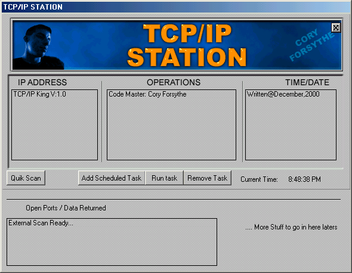



## Fastest TCP/IP PORT SCANNER EVER\!\!\!

### Description

This program scans the TCP/IP ports in a user defiend range for activity and available access... It can scan over 2000 ports in 60seconds.... I am very pleased...
 
### More Info
 
none yet :-)

             |
---                |---
**Submitted On**   |2000-12-23 01:52:28
**By**             |[Cory \( The Rat \) Forsythe](https://github.com/Planet-Source-Code/PSCIndex/blob/master/ByAuthor/cory-the-rat-forsythe.md)
**Level**          |Advanced
**User Rating**    |4.8 (38 globes from 8 users)
**Compatibility**  |VB 4\.0 \(32\-bit\), VB 5\.0, VB 6\.0
**Category**       |[Internet/ HTML](https://github.com/Planet-Source-Code/PSCIndex/blob/master/ByCategory/internet-html__1-34.md)
**World**          |[Visual Basic](https://github.com/Planet-Source-Code/PSCIndex/blob/master/ByWorld/visual-basic.md)
**Archive File**   |[CODE\_UPLOAD142091262001\.zip](https://github.com/Planet-Source-Code/cory-the-rat-forsythe-fastest-tcp-ip-port-scanner-ever__1-14750/archive/master.zip)

